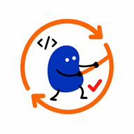

<p align="center">
  
</p>

<h1 align="center">CodeSync</h1>

<p align="center">
  An open-source Chrome extension that syncs accepted LeetCode and Codeforces submissions to GitHub.
</p>

[](https://github.com/kaustubh-dot/codesync/actions/workflows/verify.yml)

## Features

- Syncs accepted LeetCode and Codeforces solutions, problem statements, and available notes.
- Supports one shared repository or a separate Codeforces repository.
- Preserves normal language extensions and avoids duplicate Codeforces uploads.
- Supports an optional destination subdirectory.
- Keeps the GitHub token inside trusted local extension storage.
- Blocks uploads that resemble common credentials.

Historical submissions are not backfilled; CodeSync handles new accepted submissions while the
relevant coding-platform tab is open.

## Install

Requirements: Chrome 102+, Git, Node.js 20+, npm, and a GitHub repository with an initialized
default branch.

```powershell
git clone https://github.com/kaustubh-dot/codesync.git
Set-Location codesync
npm ci
npm run verify
```

Then open `chrome://extensions`, enable **Developer mode**, select **Load unpacked**, and choose the
generated `build` directory. Reload any open LeetCode or Codeforces tabs after installing,
rebuilding, or reloading the extension.

## Configure

1. Create a [fine-grained GitHub token](https://github.com/settings/personal-access-tokens/new).
2. Limit it to the destination repository or repositories.
3. Grant only **Contents: Read and write** access.
4. Open CodeSync, validate the token, and enter the repository URL:

   ```text
   https://github.com/owner/repository
   ```

5. For Codeforces, open **Settings**, connect your handle, and optionally select a separate
   repository.

Do not use a classic token, a GitHub CLI `gho_...` token, or a token with unrelated permissions.

## Use

- **LeetCode:** submit from a `leetcode.com/problems/...` page and wait for **Accepted**.
- **Codeforces:** connect the submitting handle, keep the page open through judging, and wait for
  **Accepted**.

A green toolbar badge confirms a successful upload. CodeSync writes to the repository's default
branch and organizes each problem in its own directory. In shared mode, Codeforces problems are
placed below `Codeforces/`.

## Security and privacy

The token is stored in `chrome.storage.local` and is available only to trusted extension contexts;
CodeSync has no hosted backend and does not request cookie, history, clipboard, download, or
all-sites access. Keep the token repository-scoped, give it an expiration date, and revoke it when
unused.

Public destination repositories expose solutions, notes, activity, and commit history. Never put
credentials or private data in submitted code or notes—the built-in credential check is only a
safety net. Report vulnerabilities privately as described in [SECURITY.md](SECURITY.md).

## Development

```powershell
npm run typecheck
npm test
npm run build
npm run verify
npm audit
```

GitHub Actions runs verification, dependency auditing, and CodeQL. Contributions are welcome; see
[CONTRIBUTING.md](CONTRIBUTING.md) and [CODE_OF_CONDUCT.md](CODE_OF_CONDUCT.md).

## Attribution and license

See [THIRD_PARTY_NOTICES.md](THIRD_PARTY_NOTICES.md) for required provenance and license notices.

Licensed under the [MIT License](LICENSE).
